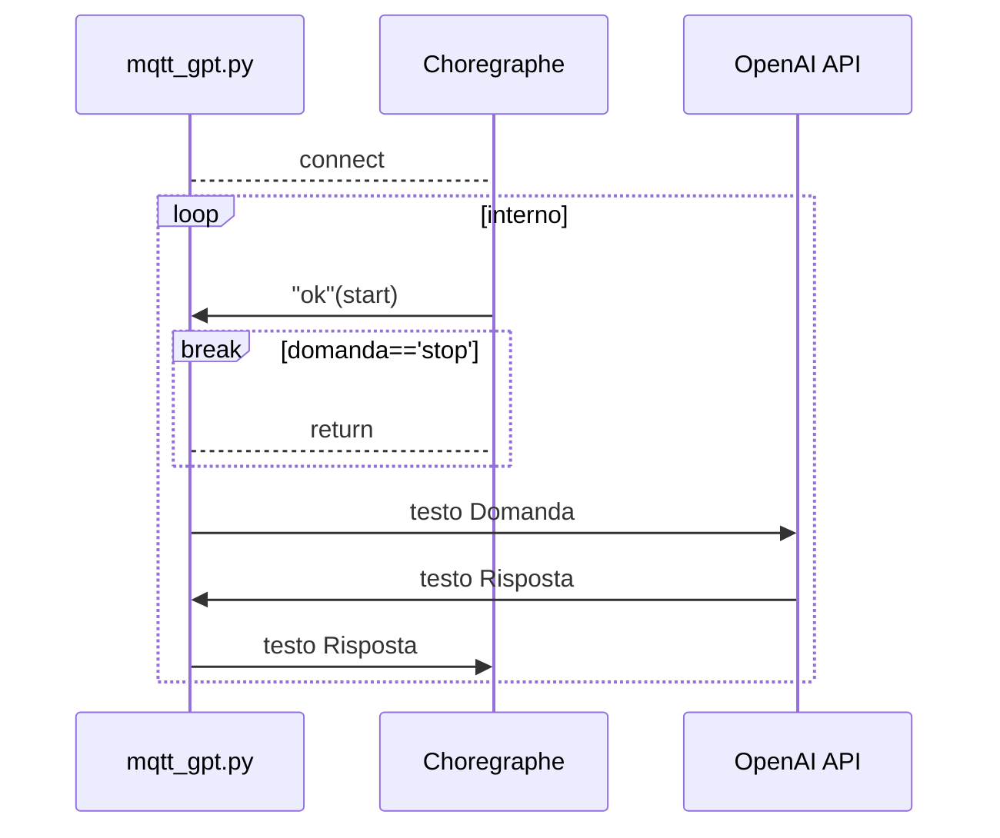
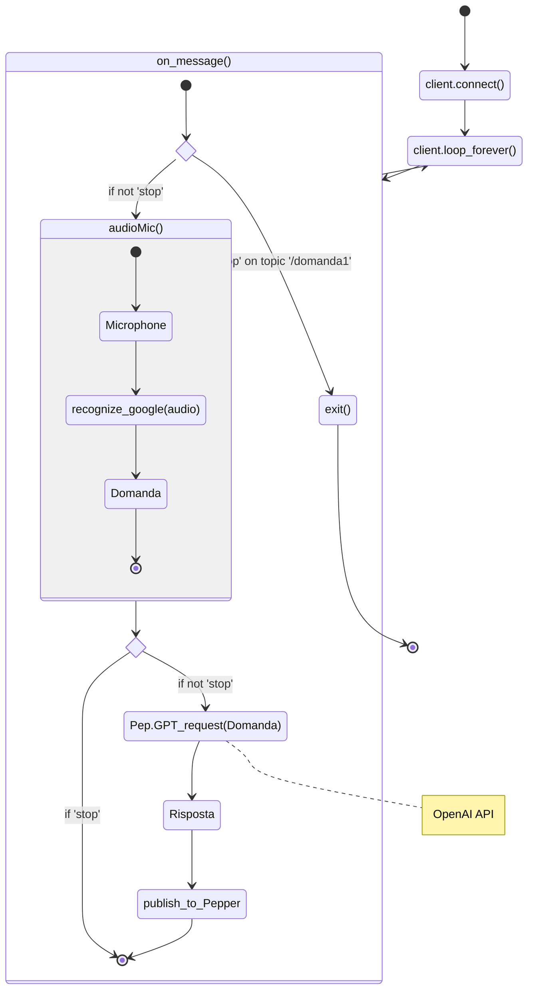
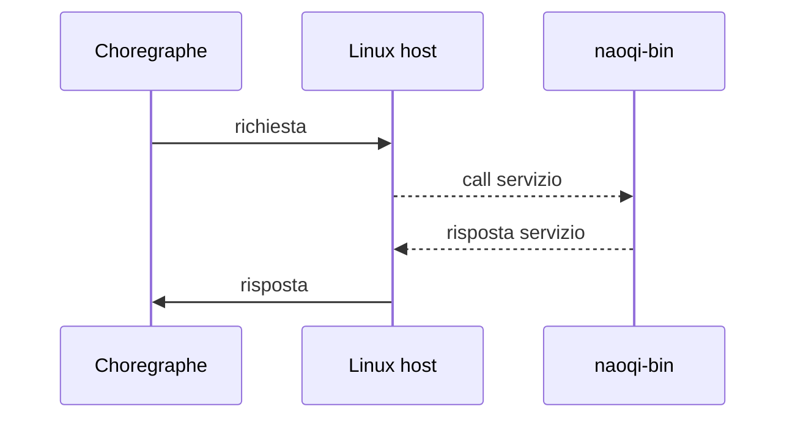
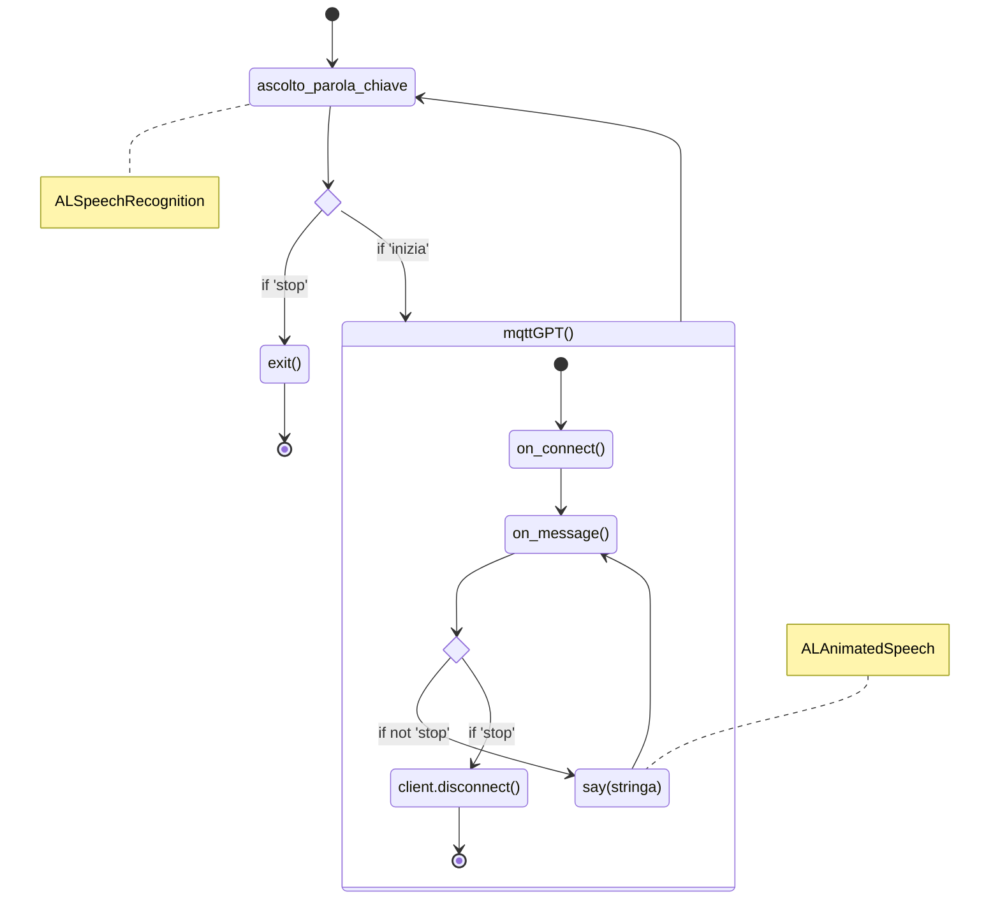

# PepperGPT

## Funzionamento generale
L'applicazione si compone di tre parti fondamentali, scritte in Python: 
* lo script `mqtt_gpt.py` si occupa dell'elaborazione dell'audio acquisito tramite il microfono, la sua conversione in stringa, la chiamata all'API di OpenAI per la determinazione della risposta e infine l'invio della stessa a Pepper;
* il progetto su Choregraphe, agente come ricevitore delle risposte e inoltro all'altoparlante di Pepper;
* OpenAI API, richiamata per l'elaborazione delle risposte.

Il riconoscimento del testo, la richiesta API e il rinvio a Pepper avvengono per mezzo di stringhe inoltrate tramite il protocollo MQTT su rete Wi-Fi locale (come un hotspot cellulare).

Il processo di esecuzione si compone in tal modo:
1. eseguire sul PC lo script `mqtt_gpt.py`, che stabilirà la connessione con il host sulla macchina Ubuntu;
2. lanciare il progetto sulla macchina virtuale con Choregraphe.

Di seguito il diagramma di comunicazione.



## Script `mqtt_gpt.py`
Il codice consiste in:
* un loop in cui il client Mqtt resta in ascolto del segnale di inizio proveniente dal codice su Choregraphe della macchina host;
* funzione `audioMic()`, che avvia la registrazione audio tramite il microfono, per mezzo di un segnale acustico di inizio e fine ascolto che consente all'utente di pronunciare la domanda, procedendo con la conversione in testo avvalendosi della libreria `speech_recognition` di Google; 
* a tal punto vi è un controllo del messaggio: se è 'stop', l'esecuzione della richiesta API OpenAI viene saltata e il loop iniziale riparte, altrimenti si prosegue con la richiesta estrapolata dall'audio nella funzione `Pep.GPT_request(Domanda)`; 
* ottenuta la stringa di risposta, il processo prosegue con l'invio della risposta su Choregraphe che provvederà a inoltrarla a Pepper e reiterare il loop; 
* contemporaneamente il client è sempre in ascolto del segnale di arresto proveniente da Choregraphe.



## Choregraphe
La macchina virtuale host contiene il processo principale Choregraphe sotto forma di progetto ( in questo caso costituito da uno script Python) che comunica con il programma `mqtt_gpt.py` e con il processo `naoqi-bin`, eseguito direttamente su Pepper, che agisce come raccolta di servizi per l'elaborazione delle varie richieste, secondo il seguente schema:



I servizi richiamati durante l'esecuzione sono: 

| **ALProxy**          | **Funzione** |
|----------------------|--------------|
| ALAnimatedSpeech     | Prende in input una stringa e la converte in audio corredato di gesture |
| ALMemory             | Crea variabili in grado di leggere i valori scritti sui registri di memoria contenenti segnali di sistema, come gli output di callback o stati di esecuzione dei servizi      |
| ALSpeechRecognition  | Servizio in grado di riconoscere delle parole da un dizionario prefissato|

### Script Python
Il progetto è costutuito da uno script Python avendo una struttura a doppio anello: 
* l'anello **esterno** implementa la modalità di standby in cui il robot è in ascolto di due parole chiave ("_inizia_" e "_stop_") per mezzo del servizio _ALSpeechRecognition_; in caso di parola "_inizia_" il programma entra nel loop interno (`mqttGPT()`), se l'input è invece "_stop_", viene inviato il segnale di arresto al processo `mqtt_gpt.py` e viene terminato il progetto;
* l'anello **interno** è l'applicazione core effettiva, in cui il programma resta in attesa della risposta proveniente da `mqtt_gpt.py` e utilizza il servizio *ALAnimatedSpeech* per pronunciare la stringa, il tutto raccolto nella funzione `mqttGPT()`.

Qui riportato lo schema dello script: 



## OpenAI
La sintesi della risposta viene affidata alla chiamata API a OpenAI; essa può essere implementata in due modi: 
1. **Chat completion**: consiste nella generazione di testo a partire da un prompt e da una stringa che svolge il ruolo di richiesta; non prevede memoria conversazionale, rendendo il dialogo meno flessibile ma più responsivo rispetto a quello di *Assistant*;
2. **Assistant**: consta della modalità *Chat completion* in aggiunta alla possibilità di implementare funzioni esterne o richiamare file contenenti prototipi di conversazione o interazioni precedenti (*file retrieval* - disponobile a pagamento) oppure della semplice *Chat completion* in cui viene conservato il contesto durante l'esecuzione, a fronte di una implementazione più laboriosa; questa modalità è largamente utilizzata in ambito commerciale per chatbot o assistenti virtuali.

In entrambi i casi il modello utilizzato è `gpt-3.5-turbo-1106` con prompt: `"You are a helpfull short assistant answering in only one sentence."` per rispondere in maniera concisa per velocizzare la comunicazione.

### Esempi di conversazione
La modalità *Chat completion* si rileva utile in quesiti di cultura generale senza necessità di contesto:

```
2024-02-01 13:26:32 Domanda: Quanti giorni ha un anno
2024-02-01 13:26:34 Risposta: Un anno ha 365 giorni, tranne gli anni bisestili che ne hanno 366.
2024-02-01 13:28:54 Domanda: Quanti giorni ha gennaio
2024-02-01 13:28:55 Risposta: Gennaio ha 31 giorni.
2024-02-01 13:29:07 Domanda: Quali sono i pianeti del sistema solare
2024-02-01 13:29:09 Risposta: I pianeti del sistema solare sono Mercurio, Venere, Terra, Marte, Giove, Saturno, Urano e Nettuno.
2024-02-01 13:29:26 Domanda: Qual è la capitale della Francia
2024-02-01 13:29:27 Risposta: La capitale della Francia è Parigi.
```

Mentre possiamo rilevare la memoria conversazionale con la modalità *Assistant*:

```
2024-02-21 15:26:21 Domanda: Ti posso chiamare Pepper
2024-02-21 15:26:23 Risposta: Certamente! Se desideri chiamarmi Pepper, va benissimo. Come posso essere d'aiuto oggi, [nome]?
2024-02-21 15:26:36 Domanda: mi chiamo Alessandro
2024-02-21 15:26:38 Risposta: Piacere di conoscerti, Alessandro! Come posso aiutarti oggi?
2024-02-21 15:26:48 Domanda: Come ti chiami
2024-02-21 15:26:50 Risposta: Mi chiamo Pepper. Come posso aiutarti oggi, Alessandro?
2024-02-21 15:27:06 Domanda: Sai dirmi quanto fa 100 + 73
2024-02-21 15:27:08 Risposta: Certamente! La somma di 100 + 73 è 173. Hai bisogno di ulteriori calcoli o informazioni?
```

## Prerequisiti
L'ambiente di sviluppo di Pepper lavora su OS `Ubuntu 14.04.6`, la cui immagine .iso (Desktop Image) può essere reperita sul sito di [Ubuntu](https://releases.ubuntu.com/14.04/).
In questa realizzazione, l'OS è eseguito su _VirtualBox_ con 3 GB di RAM, 25 GB di memoria e connessione di rete con bridge per accedere all'indirizzo IP (nome utente: `peppergpt`).

### Installazione Choregraphe
Una volta configurata la macchina, occorre scaricare il software `Old: Choregraphe`, reperibile sul [sito ufficiale](https://www.aldebaran.com/en/support/pepper-naoqi-2-9/downloads-softwares), in particolare occorre scaricare LINUX - `Old: Choregraphe 2.5.5 - Setup` e il sottostante `Old: Pepper SDK 2.5.5 - Python 2.7 SDK`, contenente le librerie di base usate.
Per installare Chroregraphe è sufficiente lanciare il file di setup scaricato (previa concessione dell'autorizzazione all'esecuzione - _tasto destro, opzione Allow execution_) e l'immissione della key presente sul sito. 

Per Python SDK: 
* estrarre e posizionare il contenuto nella cartella home della macchina;
* aprire un terminale, eseguire il comando `gedit .bashrc` e incollare in fondo alla pagina la stringa `export PYTHONPATH=${PYTHONPATH}:/home/peppergpt/<nome_libreria_estratta>/lib/python2.7/site-packages`, necessaria per rendere visibile la libreria al sistema.

### Installazione Paho Mqtt
Sempre sulla macchina, scaricare la libreria Mqtt 1.6.1 sul sito [PyPi](https://pypi.org/project/paho-mqtt/1.6.1/) - Download Files, estrarre, aprire un terminale nella cartella estratta ed eseguire il comando `sudo python setup.py install`, in seguito copiare la cartella _paho_ così creata nella cartella home e in `/home/peppergpt/<nome_libreria_estratta>/lib/python2.7/dist-packages`.

## Librerie Python utilizzate 
| **Package**          | **Versione** |
|----------------------|--------------|
| openai               | 1.4.0        |
| paho-mqtt            | 1.6.1        |
| PyAudio              | 0.2.14       |
| pydub                | 0.25.1       |
| setuptools           | 65.5.0       |
| sounddevice          | 0.4.6        |
| SpeechRecognition    | 3.10.1       |