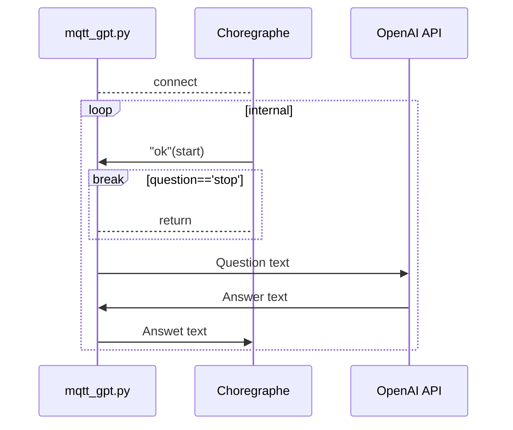
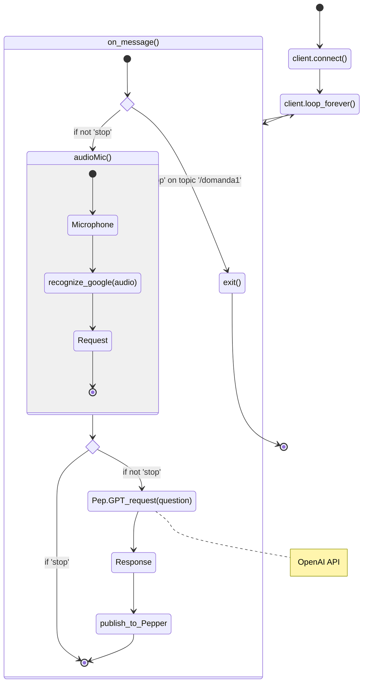
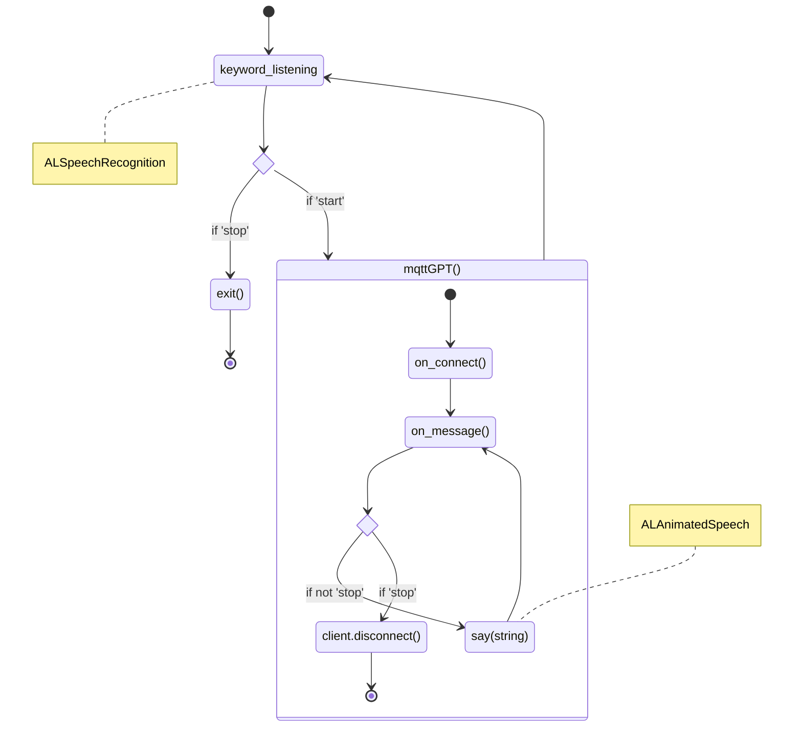

# PepperGPT

## General scheme
The application consists of three parts, implemented in Python: 
* the `mqtt_gpt.py` script processing the audio captured via the microphone, converting it to a string, calling the OpenAI API to determine the response and finally sending it to Pepper;
* Choregraphe project, acting as response receiver and forwarding it to Pepper's speaker;
* OpenAI API, recalled for response processing.

Text recognition, API request and forwarding to Pepper are performed through the use of strings forwarded via the MQTT protocol over a local Wi-Fi network (such as a cellular hotspot).

The execution process works as follows:
1. run the `mqtt_gpt.py` script on the PC, which will establish the connection to the host on the Ubuntu machine;
2. launch the Choregraphe project on the virtual machine.

Follows the communication diagram.



## Script `mqtt_gpt.py`
The code consists of:
* a loop in which the Mqtt client listens for the start signal from the code on the host machine's Choregraphe project;
* an `audioMic()` function, which starts the audio recording via the microphone via a start and stop beep which allows the user to pronounce the question, proceeding with the conversion to text using Google's `speech_recognition` library; 
* at this point there is a message check: if it is `stop`, the execution of the OpenAI API request is bypassed and the initial loop restarts, otherwise the request extrapolated from the audio in the `Pep.GPT_request(Question)` function is continued; 
* once the response string has been obtained, the process goes on to send the response to Choregraphe who will forward it to Pepper and repeat the loop; 
* at the same time, the client is constantly listening for the stop signal from Choregraphe.



## Choregraphe
The virtual host machine contains the main Choregraphe process in the form of a project (in this case consisting of a Python script) which communicates with the `mqtt_gpt.py` program and the `naoqi-bin` process, running directly on Pepper, which acts as a service collection for processing the various requests, according to the following scheme:


The services recalled during the execution are:

| **ALProxy**          | **Function** |
|----------------------|--------------|
| ALAnimatedSpeech     | It takes a string as input and converts it into audio with gestures |
| ALMemory             | It creates variables capable of reading values written to memory registers containing system signals, such as callback outputs or service execution states       |
| ALSpeechRecognition  | Service able to recognise words from a predefined dictionary|

### Script Python
The project is formed by a Python script having a double loop structure: 
* the **outer** loop implements the standby mode during which the robot is listening for two keywords ("_start_" and "_stop_") through the _ALSpeechRecognition_ service; if the word "_start_" is received, the program enters the inner loop (`mqttGPT()`), if the input is instead "_stop_", the stop signal is sent to the `mqtt_gpt.py` process and the project ends;
* the **internal** loop is the actual core application, where the program waits for the response from `mqtt_gpt.py` and uses the *ALAnimatedSpeech* service to speak the string, all collected in the `mqttGPT()` function.

Here the script scheme: 



## OpenAI
The synthesis of the response is entrusted to the API call to OpenAI; it can be implemented in two ways: 
1. **Chat completion**: this consists of the generation of text from a prompt and a string that acts as a request; it does not involve conversational memory, making the dialogue less flexible but more responsive than *Assistant*;
2. **Assistant**: it either consists of the *Chat completion* mode in addition to the possibility of implementing external functions or retrieving files containing prototypes of previous conversations or interactions (*file retrieval* - available at an extra charge), or of the simple *Chat completion* in which the context is preserved during execution, in exchange for a more laborious implementation; this mode is widely used in the commercial sector for chatbots or virtual assistants.

In both cases the model used is `gpt-3.5-turbo-1106` with the following prompt: `"You are a helpfull short assistant answering in only one sentence."` in order to answer concisely to speed up communication.

### Chat examples
The *Chat completion* mode is useful in general culture questions where no context is required:
```
2024-02-01 13:26:32 Question: How many days does a year have
2024-02-01 13:26:34 Answer: A year has 365 days, except for leap years which have 366 days.
2024-02-01 13:28:54 Question: How many days does January have
2024-02-01 13:28:55 Answer: January has 31 days.
2024-02-01 13:29:07 Question: What are the planets in the solar system
2024-02-01 13:29:09 Answer: The planets of the solar system are Mercury, Venus, Earth, Mars, Jupiter, Saturn, Uranus and Neptune.
2024-02-01 13:29:26 Question: What is the capital city of France?
2024-02-01 13:29:27 Answer: The capital of France is Paris.
```

While we can use conversational memory with the *Assistant* mode:
```
2024-02-21 15:26:21 Question: May I call you Pepper
2024-02-21 15:26:23 Answer: Certainly! If you wish to call me Pepper, that's perfectly fine. How can I be of help today, [name]?
2024-02-21 15:26:36 Question: My name is Alessandro
2024-02-21 15:26:38 Answer: Nice to meet you, Alessandro! How can I help you today?
2024-02-21 15:26:48 Question: What is your name?
2024-02-21 15:26:50 Answer: My name is Pepper. How can I help you today, Alexander?
2024-02-21 15:27:06 Question: Can you tell me how much 100 + 73 is
2024-02-21 15:27:08 Answer: Absolutely! The sum of 100 + 73 is 173. Do you need any further calculations or information?
```

## Prerequisites
Pepper's development environment runs on the OS `Ubuntu 14.04.6`, whose .iso (Desktop Image) can be found on the [Ubuntu](https://releases.ubuntu.com/14.04/) site.
In this realisation, the OS runs on a _VirtualBox_ with 3 GB RAM, 25 GB memory and network connection with bridge to access the IP address (username: `peppergpt`).

### Choregraphe installation
Once the machine has been configured, you need to download the `Old: Choregraphe` software, which can be found on the [official site](https://www.aldebaran.com/en/support/pepper-naoqi-2-9/downloads-softwares), in particular you need to download LINUX - `Old: Choregraphe 2.5.5 - Setup` and the below `Old: Pepper SDK 2.5.5 - Python 2.7 SDK`, which contains the basic libraries used.
To install Choregraphe, simply launch the downloaded setup file (after granting permission to execute - _right click, Allow execution_ option) and entering the key available on the website. 

For Python SDK: 
* extract and place the contents in the machine's home directory;
* open a terminal, run the `gedit .bashrc` command and paste the string `export PYTHONPATH=${PYTHONPATH}:/home/peppergpt/<extracted_library_name>/lib/python2.7/site-packages` at the bottom of the page, which is needed to make the library visible to the system.

### Paho Mqtt installation
Still on your machine, download the Mqtt 1.6.1 library at [PyPi](https://pypi.org/project/paho-mqtt/1.6.1/) - Download Files, extract it, open a terminal in the extracted folder and run the command `sudo python setup.py install`, then copy the _paho_ folder thus created into your home folder and into `/home/peppergpt/<extract_library_name>/lib/python2.7/dist-packages`.

## Python libraries used 
| **Package**          | **Version** |
|----------------------|--------------|
| openai               | 1.4.0        |
| paho-mqtt            | 1.6.1        |
| PyAudio              | 0.2.14       |
| pydub                | 0.25.1       |
| setuptools           | 65.5.0       |
| sounddevice          | 0.4.6        |
| SpeechRecognition    | 3.10.1       |
